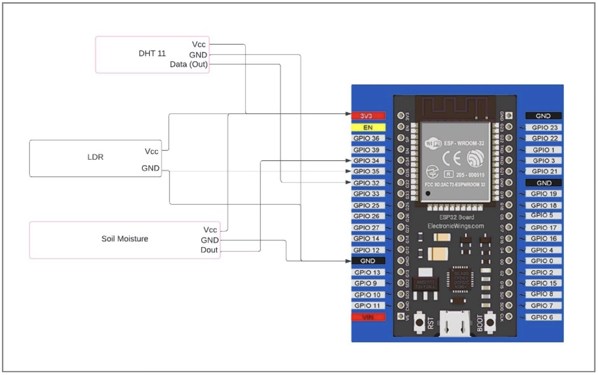

# IoT Crop Management System

## 📌 Overview
The **IoT Crop Management System** is an ESP32-based project that monitors environmental parameters crucial for crop health, including:
- 🌡 Temperature
- 💧 Humidity
- ☀️ Light Intensity
- 🌱 Soil Moisture

When any parameter exceeds its predefined threshold, the system automatically sends an **email alert** using SMTP.

---

## 🛠 Components Used
- **ESP32 microcontroller**
- **DHT11** temperature & humidity sensor
- **Soil Moisture Sensor**
- **LDR (Light Dependent Resistor)**
- Breadboard & jumper wires
- Wi-Fi connection

---

## 📋 Features
- Real-time environmental monitoring
- Email notifications on threshold exceed
- Simple circuit with minimal components
- Can be adapted for smart agriculture automation

---

## 📐 Circuit Diagram
  
*(Replace with your actual image path)*

---

## 💻 Source Code
The main Arduino code is in:  
[`iot_crop_management.ino`](iot_crop_management.ino)  

**Note:** Replace the following placeholders in the code before uploading to ESP32:
```cpp
#define WIFI_SSID "YOUR_WIFI_NAME"
#define WIFI_PASSWORD "YOUR_WIFI_PASSWORD"
#define sender_email "your_email@gmail.com"
#define sender_password "your_app_password"
#define Recipient_email "recipient_email@gmail.com"
#define Recipient_name "Recipient"
